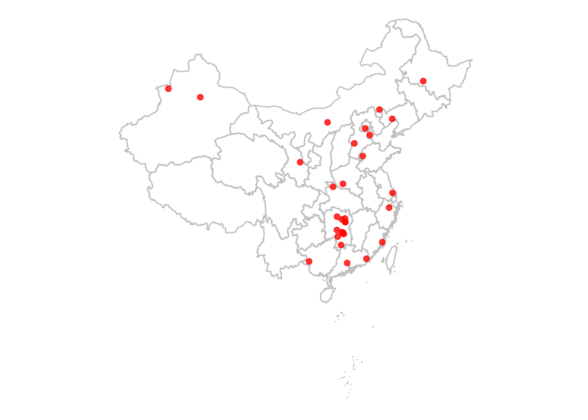
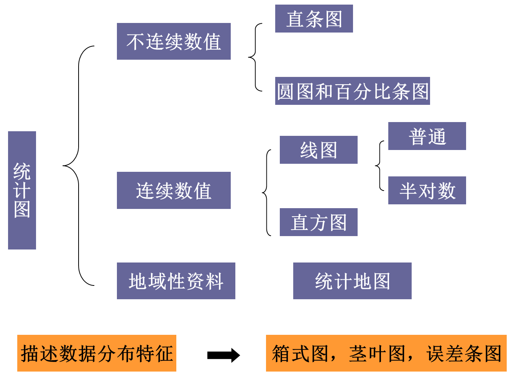

# 第十章 统计表与统计图
x2yline  
`r Sys.Date()`  


## 知识清单：
* 1. 统计表
    * 原则
    * 要求
    * 种类
    * 注意事项
* 2. 统计图
    * 原则
    * 意义
    * 种类
    
## 1. 统计表
### 1.1 制表原则
> 重点突出，一张表表达一种意思即可

> 主语（对象）作为横标目，宾语（内容）作为纵标目，由左往右构成完整的一句话

> 简单明了，文字、数字和线条从简

### 1.2 基本要求

> 标题，概括包括时间地点和内容，放在表上方

> 标目，分横纵，注明指标单位

> 线条，三条（部分表可用横线将合计，或两纵标目分开）

> 数字，阿拉伯数字，无数字用“-”表示，缺失用“···”表示，数值为0标记为“0”，不留空，数字按小数位对齐

> 数字区不能插入文字，必须说明者表“*”号，表下备注说明

### 1.3 种类
* 简单表
    * 主语只有一个层次
* 组合表
    * 主语有两个以上层次，在纵标目中加横线分开
* 频数分布表
    * 横标目为分组，纵标目为计数
* 列联表
    * 观测数据按两个或更多属性（定性变量）分类时所列出的频数表

## 2. 统计图
###  2.1 原则
* 根据资料的性质和分析目的选用适当的统计图
    * 独立、不连续、无数量关系的多个组或类别的统计量（如例数，相对数和均数等）选用`直条图`
    * 分析指标随时间或其他连续变量变化用线图
    * 频数分布用`直方图`
    * 描述构成用饼图或百分条图
* 标题，概括包括时间地点和内容，放在图下方
* 横纵轴的比例以5:7或7:5为宜
* 不同线条或颜色映射不同变量时，需要加图例，放在右上角或下方中间

### 2.2 意义
数据形象化，常需同时列出统计表作为数值依据

### 2.3 种类
#### 2.3.1 直条图（bar chart）
用相同宽度的直条长短表示某统计指标的大小，按横竖摆放分卧式和立式条图，按分组层次多还是单分单式和复式条图
* 复式条图, 如[ggplot作复式条图](http://www.jianshu.com/p/030291e2ee6a)

> 直条间隔一般与直条等宽或为其一半，排列顺序可按大小或自然分组顺序

> 直条图的纵轴尺度起点必须为零

* R语言实现

```r
# 构建数据
df <- data.frame(dose=c("D0.5", "D1", "D2"),
                len=c(4.2, 10, 29.5))
# 作图
library(ggplot2)
# Basic barplot
p<-ggplot(data=df, aes(x=dose, y=len)) +
  geom_bar(stat="identity")
print(p)
```

<!-- -->

```r
# 转为卧式直条图
p + coord_flip()
```

<!-- -->
还有很多种变化可以参考：http://www.sthda.com/english/wiki/ggplot2-barplots-quick-start-guide-r-software-and-data-visualization

#### 2.3.2 圆图和百分比图
> 圆图(pie chart)是以圆形总面积作为100%，将其分割成若干个扇面表示事物内部各构成部分所占的比例

> 百分比条图(percent bar chart)是以矩形总长度作为100%，将其分割成不同长度的段表示各构成的比例

> 圆图和百分比条图适合描述分类变量的构成比资料


#### 2.3.3 线图(line graph)
> 线图是用线段的升降来表示数值的变化，适合于描述某统计量随另一连续性数值变量变化而变化的趋势，最常用于描述统计量随时间变化而变化的趋势。
  
* 普通线图：横轴和纵轴都是算术尺度（绝对变化数）   
* 半对数线图：横轴是算术尺度，纵轴是对数尺度，特别适宜作不同指标变化速度的比较（相对变化数）。   

#### 2.3.4 直方图(histogram)
> 以直方面积描述各组频数的多少，面积的总和相当于各组频数之和，适合表示数值变量的频数分布。直方图的横轴尺度是数值变量值，纵轴是频数。

> 注意如各组的组距不等时，要折合成等距后再绘图，即将频数除以组距得到单位组距的频数作为直方的高度，组距为直方的宽度。

> 另一种表示数值变量资料频数分布的方式是将各组段观察频数除以总观察频数得到各组段的频率，以各组段频率除以组距得到的频率密度作为直方图高度，绘制的直方图称为频率直方图，它以各直方面积表示各组频率，其面积的总和为1。

> 散点图以直角坐标系中各点的密集程度和趋势来表示两现象间的关系。常在对资料进行相关分析之前使用。

> 适用资料：双变量资料。

#### 2.3.6 统计地图(statistical map) 
> 统计地图是用不同的颜色和花纹表示统计量的值在地理分布上的变化，适宜描述研究指标的地理分布。     


```r
# 设置api秘钥
options(remap.ak="P6VDgmNVU7NcIbKyG8yHWWCpodkOGvmS")
# 加载地图数据
library(maptools)
```

```
## Loading required package: sp
```

```
## Checking rgeos availability: TRUE
```

```r
library(ggplot2)
# .shp文件
map_data <- readShapePoly(file.choose())
```

```
## Warning: use rgdal::readOGR or sf::st_read
```

```r
gg1 <- ggplot() + 
  geom_polygon(data = map_data, 
               aes(x=long, y = lat, group = group), 
               fill=NA, color="gray") +
  coord_fixed(1.4)+theme_void()
```

```
## Regions defined for each Polygons
```

```r
library(REmap)
origin = c('潮州','北京','广州','包头','衡阳',
                '桃源县','邵阳','湘阴县','长沙市','衡南县', 
                '蓝山县', '长沙市', '永州市', '赤峰市', '衡阳县', 
                '益阳市', '锦州市', '福清市', '广西百色德保县', '聊城市', 
                '天津市', '海门市', '新疆', '博乐市', '哈尔滨',
                '绍兴市', '石家庄市', '十堰市', '南阳市', '会宁县')
# 批量获取经纬度信息
## get_city_coord("潮州")
# loc_data <- get_geo_position(origin)

# 构建点图数据框
# labs <- data.frame(lon=as.numeric(loc_data$lon),
#                    lat=as.numeric(loc_data$lat),
#                    names=as.character(1:30), 
#                    stringsAsFactors=FALSE)
# gg1 + geom_point(data = labs, aes(x = lon, y = lat), 
#                  color = "red", size = 2, alpha=0.8)
```


```r
library(REmap)
origin = c('潮州','北京','广州','包头','衡阳',
                '桃源县','邵阳','湘阴县','长沙市','衡南县', 
                '蓝山县', '长沙市', '永州市', '赤峰市', '衡阳县', 
                '益阳市', '锦州市', '福清市', '广西百色德保县', '聊城市', 
                '天津市', '海门市', '新疆', '博乐市', '哈尔滨',
                '绍兴市', '石家庄市', '十堰市', '南阳市', '会宁县')
destination  = rep("长沙",30)
dat = data.frame(origin,destination)
# out = remap(dat,title = "",subtitle = "", theme = get_theme("Bright"))
# plot(out)
```

参考：  
https://cosx.org/2016/06/introduction-to-remap  
https://jingyan.baidu.com/article/363872eccda8286e4aa16f4e.html   

#### 2.3.7 箱式图
> 使用5个统计量反映原始数据的分布特征，即数据分布中心位置、分布、偏度、变异范围和异常值。

一般变异范围设定为下四分位数-1.5$*$IQR到上四分位数+1.5$*$IQR之间，超出该范围则为异常值

参考：  
http://blog.sina.com.cn/s/blog_3ed6c6bb0102uxz5.html

#### 2.3.8 误差条图(error bar chart) 
通过样本信息来描述总体，估计抽样误差的大小。特别适合比较多个样本间的差异情况。误差条图可以显示三种不同的区间：可信区间、$\bar{X}\pm S$和$\bar{X}\pm S_{\bar{X}}$ 。

#### 2.3.9 茎叶图(stem-leaf plot)
> 将数据分离成两部分：整数部分和尾数部分，整数部分形成图的茎，尾数部分形成图的叶。茎叶图的排列方式与频数表有些相似，每行由一个整数的茎和若干叶构成。左边是茎的数值，茎宽一般标在图的下方。右边是叶，图显示每个叶的尾数数值，同样在图的下方标示每个叶代表几个实际观察值。茎叶图可以非常直观地显示数据的分布范围和形态，近年非常流行。

## 统计图的选择


