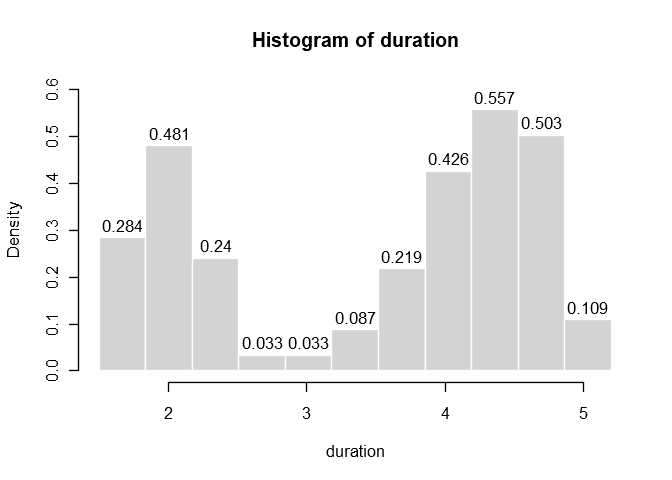

# 第二章 计量资料的统计描述
x2yline  
2017年10月18日  


## 知识清单：

* 求极差（range）
* 做频数分布表和频数分布图（graph of frequency distribution）
* 算术平均数（mean）
* 几何均数（geometric mean）
* 中位数与百分位数（median and percentile）
* 四分位间距（quartile range）
* 方差（variance）
* 标准差（standard deviation）
* 变异系数（coefficient of variance）
* 正态分布（normal distribution）
* 标准正态分布（standard normal distribution）

## 图形美观，5:7或7:5

## 使用R语言的内建实例数据框：faithful


```r
head(faithful)
```

```
##   eruptions waiting
## 1     3.600      79
## 2     1.800      54
## 3     3.333      74
## 4     2.283      62
## 5     4.533      85
## 6     2.883      55
```

第一列eruptions代表火山喷发的持续时间，第二列代表距离下一次喷发的间隔时间

## 1. 计算极差（range）


```r
duration <- faithful$eruptions     # the eruption durations
max(duration)-min(duration)     # apply the max and min functions
```

```
## [1] 3.5
```

```r
range(duration)
```

```
## [1] 1.6 5.1
```

## 2. 频数分布


```r
duration = faithful$eruptions
breaks = seq(1.5, 5.2, length.out = 12)
duration.cut = cut(duration, breaks, right=FALSE)
```

right属性默认为TRUE，表示每个组段为右闭左开的一个区间

duration.cut为一个factor变量


```r
duration.freq = table(duration.cut)
duration.freq
```

```
## duration.cut
##  [1.5,1.84) [1.84,2.17) [2.17,2.51) [2.51,2.85) [2.85,3.18) [3.18,3.52) 
##          26          44          22           3           3           8 
## [3.52,3.85) [3.85,4.19) [4.19,4.53) [4.53,4.86)  [4.86,5.2) 
##          20          39          51          46          10
```

```r
cbind(duration.freq)
```

```
##             duration.freq
## [1.5,1.84)             26
## [1.84,2.17)            44
## [2.17,2.51)            22
## [2.51,2.85)             3
## [2.85,3.18)             3
## [3.18,3.52)             8
## [3.52,3.85)            20
## [3.85,4.19)            39
## [4.19,4.53)            51
## [4.53,4.86)            46
## [4.86,5.2)             10
```

计算频率


```r
duration.relfreq = duration.freq / nrow(faithful)
```

展示为列的形式


```r
cbind(duration.freq)
```

```
##             duration.freq
## [1.5,1.84)             26
## [1.84,2.17)            44
## [2.17,2.51)            22
## [2.51,2.85)             3
## [2.85,3.18)             3
## [3.18,3.52)             8
## [3.52,3.85)            20
## [3.85,4.19)            39
## [4.19,4.53)            51
## [4.53,4.86)            46
## [4.86,5.2)             10
```

```r
hist(duration, right=FALSE, 
     breaks = breaks, labels =TRUE, 
     freq = FALSE, col = "lightgray", 
     border = "white", ylim=c(0, 0.6))
```

<!-- -->

tips: 控制输出小数点位数使用


## 3. 算术平均


```r
mean(faithful$eruptions)
```

```
## [1] 3.487783
```

## 4. 几何平均


```r
# 方法1
exp(mean(log(faithful$eruptions)))
```

```
## [1] 3.271313
```

```r
# 方法2
psych::geometric.mean(faithful$eruptions)
```

```
## [1] 3.271313
```

## 5. 中位数与百分位数


```r
# 方法1
quantile(faithful$eruptions, c(0.5, 0.6))
```

```
##   50%   60% 
## 4.000 4.167
```

```r
quantile(faithful$eruptions)
```

```
##      0%     25%     50%     75%    100% 
## 1.60000 2.16275 4.00000 4.45425 5.10000
```

```r
# 方法2
median(faithful$eruptions)
```

```
## [1] 4
```

## 6. 四分位间距 interquartile range


```r
IQR(faithful$eruptions)
```

```
## [1] 2.2915
```

## 7. 方差与标准差


```r
# 方法1
var(faithful$eruptions)
```

```
## [1] 1.302728
```

```r
sd(faithful$eruptions)
```

```
## [1] 1.141371
```

```r
sd(faithful$eruptions)^2
```

```
## [1] 1.302728
```

```r
# 方法2
(sum((faithful$eruptions-mean(faithful$eruptions))^2))/(nrow(faithful)-1)
```

```
## [1] 1.302728
```

## 8. 变异系数


```r
# 方法1
raster::cv(faithful$eruptions)
```

```
## [1] 32.72483
```

```r
# 方法2
sd(faithful$eruptions)/mean(faithful$eruptions)*100
```

```
## [1] 32.72483
```

## 9. 正态分布和标准正态分布

dnorm() 的返回值是正态分布概率密度函数，pnorm()返回值是正态分布的分布函数。函数qnorm()的返回值是给定概率p后的下分位点，rnorm()的返回值是n个正态分布随机数构成的向量。

已知某正态分布均值为72，标准差为15.2，求在72出的概率密度：

```r
dnorm(72, mean=72, sd=15.2)
```

```
## [1] 0.0262462
```

已知某正态分布均值为72，标准差为15.2，求大于84的概率：


```r
pnorm(84, mean=72, sd=15.2, lower.tail=FALSE)
```

```
## [1] 0.2149176
```


已知某正态分布均值为0，标准差为1，求小于多少值时，其概率大于0.975


```r
qnorm(0.975, mean=0, sd=1, lower.tail=TRUE)
```

```
## [1] 1.959964
```

生成服从正态分布，均值为0，标准差异1的100个数：


```r
rnorm(100, mean=0, sd=1)
```

```
##   [1]  0.9088583642  0.0542498619  0.8192914926  1.1587866403  0.7487648897
##   [6] -0.6168902920  0.1078935715  1.1951336445  0.0036975486  1.2966867773
##  [11]  0.8183264357  1.6389580967 -2.2247298218  0.6398493038  1.9140149307
##  [16]  0.0089555834 -0.3414749680 -3.0666206389 -0.1869732270  0.0276825106
##  [21] -1.2886633515 -1.9952968803  1.6209100626 -0.2066936489  0.3063477355
##  [26] -1.1427716887 -0.5210954458 -0.2173103906  1.4138234019 -0.8771639541
##  [31] -0.0563205068 -0.5469693491 -0.0919514738 -1.0536534005  0.3280428784
##  [36] -0.1913467409  1.1183458357 -0.8164286750 -1.1930315180  0.5040919775
##  [41]  0.0484081964  0.2740911516 -0.7203243195 -0.6433319016  0.1492631486
##  [46]  0.4243109544  0.9278891381 -0.6699978375 -1.1791959728 -0.0001789145
##  [51]  1.0038939206 -1.2324811382  0.4867781216 -0.4942327893 -2.0529696481
##  [56]  2.4122364364  1.7431045123 -0.3244588575  1.5236568606  0.7760359808
##  [61]  0.1699323512 -0.3825630252 -0.4113679610 -0.9148805975  0.7097139924
##  [66]  1.0609423792 -0.8792786231  0.0760109742 -0.8517641438  0.8935719300
##  [71]  2.7318160388 -0.0798947127 -1.2611194676 -0.1763794916  1.0069220462
##  [76] -0.4557541627 -0.1761056609 -0.3785240264 -0.6634945059  1.8784143859
##  [81] -0.4525364564 -0.6530406635 -1.7098681794  0.3531260338  0.5350506660
##  [86] -1.4036929289 -0.8077669355  0.4961741708  0.5182125445  0.0539005615
##  [91]  0.2852671834 -0.1823420591  0.6861371520 -0.7258706420 -0.1963522908
##  [96] -0.2294918321  1.1703042902  0.1984311847  2.6846082633  1.3155942701
```


参考：

<http://www.r-tutor.com/elementary-statistics>
